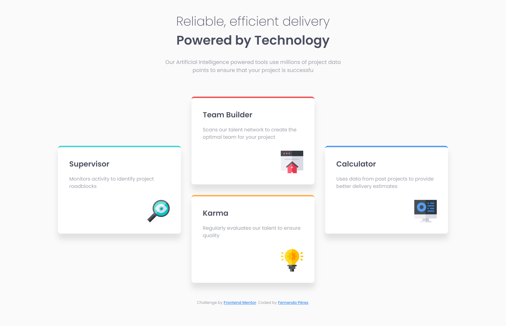

# Frontend Mentor - Four card feature section solution

This is a solution to the [Four card feature section challenge on Frontend Mentor](https://www.frontendmentor.io/challenges/four-card-feature-section-weK1eFYK). Frontend Mentor challenges help you improve your coding skills by building realistic projects.

## Table of contents

- [Overview](#overview)
  - [The challenge](#the-challenge)
  - [Screenshot](#screenshot)
  - [Links](#links)
- [My process](#my-process)
  - [Built with](#built-with)
  - [Useful resources](#useful-resources)
- [Author](#author)

## Overview

### The challenge

Users should be able to:

- View the optimal layout for the site depending on their device's screen size

### Screenshot

📱 Mobile

📱 Tablet

💻 Desktop

### Links

- Solution URL: [https://www.frontendmentor.io/solutions/four-card-feature-section--j-sv4bY9z](hhttps://www.frontendmentor.io/solutions/four-card-feature-section--j-sv4bY9z)
- Live Site Here: [https://fermop.github.io/Frontend_Mentor-12thChallenge/](https://fermop.github.io/Frontend_Mentor-12thChallenge/)

## My process

### Built with

- Semantic HTML5 markup
- CSS custom properties
  - Grid
- Mobile-first workflow
- BEM naming convention

### Useful resources

- [BEM](https://9elements.com/bem-cheat-sheet/) - What is BEM? BEM stands for Block, Element, and Modifier. It’s a CSS naming convention for writing cleaner and more readable CSS classes. BEM also aims to write independent CSS blocks in order to reuse them later in your project.
- [Josh Comeau’s CSS reset](https://www.joshwcomeau.com/css/custom-css-reset/) - This reset makes browsers render all elements more consistently and in line with modern standards. It precisely targets only the styles that need to be reset.

## Author

- Frontend Mentor - [@fermop](https://www.frontendmentor.io/profile/fermop)
- Instagram - [fermop_](https://www.instagram.com/fermop_/)
- Facebook - [Fernando Mojica](https://www.facebook.com/fernando.mojica.758737/)